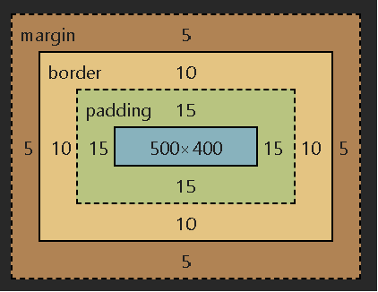
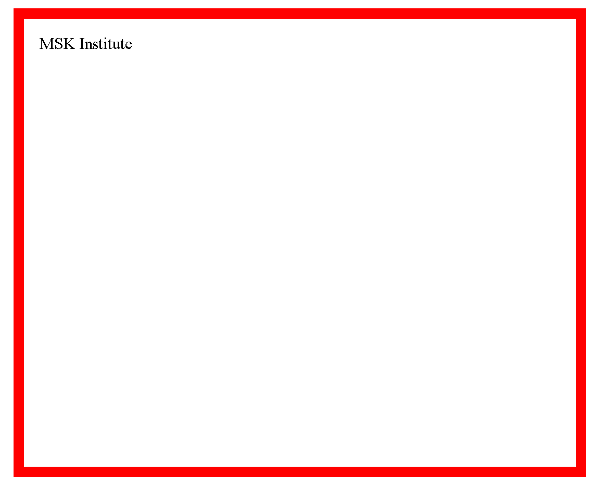

# CSS Box Model

The CSS Box model defines how elements are rendered and how their dimensions are calculated.

It describes the structure of an element as a rectangular box that has content, padding, a border, and a margin.

The box model consists of four main components, which are



## 1\. Content

-   The innermost component of the box model is the actual content of the element. It can be text, image, video, etc.
-   The content area is defined by the **width** and **height** properties.

## 2\. Padding

-   The space between the actual content and the border of the element is the padding.
-   The padding area is defined by the property **padding**. For more details, follow the [CSS Padding]() tutorial.

## 3\. Border

-   The border surrounds the content and padding and gives the visual border of the element.
-   The border properties can be controlled using the **border** keyword. For more details, follow the [CSS Borders](../08_Borders/01_Borders.md) tutorial.

## 4\. Margin

-   The margin is the space outside the element that separates it from other elements in the layout.
-   The margin of the element is controlled by the **margin** property. For more details, follow the [CSS Margin]() tutorial.

The CSS Box model can be visually represented as:

### Calculating the total dimension of the element

The total width and height of the element is calculated with the formula:

**Total Width** = Width + Left Padding + Right Padding + Left Border + Right Border + Left Margin + Right Margin

**Total Height** = Height + Top Padding + Bottom Padding + Top Border + Bottom Border + Top Margin + Bottom Margin

**[Example:](./examples/01_box_modal.html)**

```html
<html>
<head>
    <style>
        p{
            width: 500px;
            height: 400px;
            padding: 15px;
            border: 10px solid red;
            margin: 5px;
        }
    </style>
</head>
<body>
    <p>MSK Institute</p>
</body>
</html>
```


Here, the total height and width will be represented as

**Total Width** = 500px (width) + 15px (left padding) + 15px (right padding) + 10px (left border) + 10px (right border) + 5px (left margin) + 5px (right margin) = 560px.

**Total Height** = 400px (Height) + 15px (Top Padding) + 15px (Bottom Padding) + 10px (Top Border) + 10px (Bottom Border) + 5px (Top Margin) + 5px (Bottom Margin) = 460px

### Playaround:

To view the dimension of any element follow the steps or video:

1.  Right-click and click on Inspect.
2.  Click on the arrow key in the top left corner.
3.  Select the element
4.  Unhide the computed styles sidebar.
5.  Toggle the properties.
