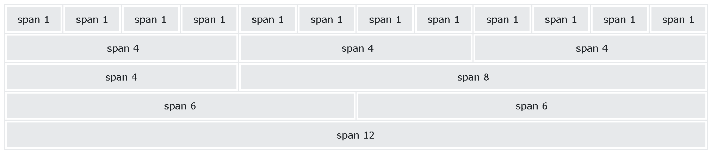

## Bootstrap 5 Grid System

Bootstrap's grid system is built with flexbox and allows up to 12 columns across the page.

If you do not want to use all 12 columns individually, you can group the columns together to create wider columns:



The grid system is responsive, and the columns will re-arrange automatically depending on the screen size.

Make sure that the sum adds up to 12 or fewer (it is not required that you use all 12 available columns).

## Grid Classes

The Bootstrap 5 grid system has six classes:

-   `.col-` (extra small devices - screen width less than 576px)
-   `.col-sm-` (small devices - screen width equal to or greater than 576px)
-   `.col-md-` (medium devices - screen width equal to or greater than 768px)
-   `.col-lg-` (large devices - screen width equal to or greater than 992px)
-   `.col-xl-` (xlarge devices - screen width equal to or greater than 1200px)
-   `.col-xxl-` (xxlarge devices - screen width equal to or greater than 1400px)

The classes above can be combined to create more dynamic and flexible layouts.

**Tip:** Each class scales up, so if you want to set the same widths for `sm` and `md`, you only need to specify `sm`.

## Basic Structure of a Bootstrap 5 Grid

The following is a basic structure of a Bootstrap 5 grid:
```html
<!-- Control the column width, and how they should appear on different devices -->  
<div class="row">  
  <div class="col-*-*"></div>  
  <div class="col-*-*"></div>  
</div>  
<div class="row">  
  <div class="col-*-*"></div>  
  <div class="col-*-*"></div>  
  <div class="col-*-*"></div>  
</div>  
  
<!-- Or let Bootstrap automatically handle the layout -->  
<div class="row">  
  <div class="col"></div>  
  <div class="col"></div>  
  <div class="col"></div>  
</div>
```
First example: create a row (`<div class="row">`). Then, add the desired number of columns (tags with appropriate `.col-*-*` classes). The first star (*) represents the responsiveness: sm, md, lg, xl or xxl, while the second star represents a number, which should add up to 12 for each row.

Second example: instead of adding a number to each `col`, let bootstrap handle the layout, to create equal width columns: two `"col"` elements = 50% width to each col, while three cols = 33.33% width to each col. Four cols = 25% width, etc. You can also use `.col-sm|md|lg|xl|xxl` to make the columns responsive.

Below we have collected some examples of basic Bootstrap 5 grid layouts.

## Three Equal Columns

The following example shows how to create three equal-width columns, on all devices and screen widths:

### Example
```html
<div class="row">  
  <div class="col">.col</div>  
  <div class="col">.col</div>  
  <div class="col">.col</div>  
</div>
```

## Responsive Columns

The following example shows how to create four equal-width columns starting at tablets and scaling to extra large desktops. **On mobile phones or screens that are less than 576px wide, the columns will automatically stack on top of each other**:

### Example
```html
<div class="row">  
  <div class="col-sm-3">.col-sm-3</div>  
  <div class="col-sm-3">.col-sm-3</div>  
  <div class="col-sm-3">.col-sm-3</div>  
  <div class="col-sm-3">.col-sm-3</div>  
</div>
```

## Two Unequal Responsive Columns


The following example shows how to get two various-width columns starting at tablets and scaling to large extra desktops:

### Example

<div class="row">  
  <div class="col-sm-4">.col-sm-4</div>  
  <div class="col-sm-8">.col-sm-8</div>  
</div>

[Try it Yourself »](https://www.w3schools.com/bootstrap5/bootstrap_grid_basic.phptryit.asp?filename=trybs_grid_ex2&stacked=h)